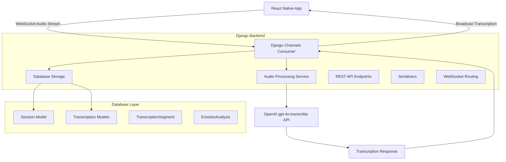

# Design Document

## Overview

The real-time transcription system extends the existing Django backend to provide live audio transcription capabilities for therapy sessions using OpenAI's gpt-4o-transcribe model. The design integrates seamlessly with the existing `TherapySessionConsumer` WebSocket infrastructure and `Session` model, adding transcription functionality without disrupting current workflows.

The system follows Django best practices, implements comprehensive OpenAPI documentation, and provides efficient real-time audio processing through WebSocket connections. The architecture supports concurrent sessions, speaker identification, and maintains HIPAA compliance for patient data protection.

## Architecture

### High-Level Architecture



### Component Integration

The transcription system integrates with existing components:

- **TherapySessionConsumer**: Extended to handle audio data and transcription events
- **Session Model**: Already includes transcription_id field and AI analysis fields
- **Existing WebSocket Infrastructure**: Reuses room management and authentication
- **REST API Framework**: Extends existing patterns for transcription control endpoints

## Components and Interfaces

### 1. Enhanced WebSocket Consumer

**File**: `therapy_sessions/consumers.py` (Extended)

The existing `TherapySessionConsumer` will be enhanced with transcription capabilities:

```python
class TherapySessionConsumer(AsyncWebsocketConsumer):
    # Existing methods remain unchanged
    
    # New transcription-specific methods
    async def handle_transcription_control(self, data)
    async def handle_audio_chunk(self, data)
    async def process_audio_transcription(self, audio_data)
    async def broadcast_transcription_result(self, result)
    async def transcription_status_changed(self, event)
    async def transcription_result(self, event)
```

**WebSocket Message Types**:
- `transcription_control`: Start/stop/pause transcription
- `audio_chunk`: Real-time audio data streaming
- `transcription_result`: Live transcription results
- `transcription_status`: Status updates (processing, error, etc.)

### 2. Transcription Service Layer

**File**: `transcription/services.py` (New)

Core business logic for transcription processing:

```python
class TranscriptionService:
    async def start_transcription(self, session_id: UUID) -> bool
    async def stop_transcription(self, session_id: UUID) -> bool
    async def process_audio_chunk(self, session_id: UUID, audio_data: bytes, speaker_type: str) -> dict
    async def finalize_transcription(self, session_id: UUID) -> Transcription
    
class OpenAITranscriptionClient:
    async def transcribe_audio(self, audio_data: bytes, language: str = None) -> dict
    async def stream_transcription(self, audio_stream) -> AsyncGenerator[dict, None]
```

### 3. Enhanced Models

**File**: `transcription/models.py` (Enhanced)

The existing models will be enhanced with real-time processing fields:

```python
class Transcription(models.Model):
    # Existing fields remain
    is_realtime = models.BooleanField(default=False)
    websocket_room_id = models.UUIDField(null=True, blank=True)
    transcription_enabled = models.BooleanField(default=True)
    current_status = models.CharField(max_length=20, choices=REALTIME_STATUS)
    
class TranscriptionSegment(models.Model):
    # Existing fields remain
    is_final = models.BooleanField(default=False)
    sequence_number = models.IntegerField()
    audio_chunk_id = models.CharField(max_length=100, null=True)
```

### 4. REST API Endpoints

**File**: `transcription/views.py` (New)

RESTful endpoints for transcription management:

```python
class TranscriptionControlView(APIView):
    """Control transcription for a session"""
    
class TranscriptionStatusView(APIView):
    """Get transcription status and progress"""
    
class TranscriptionHistoryView(ListAPIView):
    """Retrieve session transcription history"""
    
class TranscriptionSettingsView(APIView):
    """Manage transcription preferences"""
```

### 5. Serializers

**File**: `transcription/serializers.py` (New)

Django REST Framework serializers with comprehensive field documentation:

```python
class TranscriptionControlSerializer(serializers.Serializer):
    """Serializer for transcription control requests"""
    
class TranscriptionStatusSerializer(serializers.ModelSerializer):
    """Serializer for transcription status responses"""
    
class TranscriptionSegmentSerializer(serializers.ModelSerializer):
    """Serializer for individual transcription segments"""
    
class RealtimeTranscriptionEventSerializer(serializers.Serializer):
    """Serializer for WebSocket transcription events"""
```

## Data Models

### Enhanced Transcription Model

```python
class Transcription(models.Model):
    id = models.UUIDField(primary_key=True, default=uuid.uuid4)
    session = models.OneToOneField('therapy_sessions.Session', on_delete=models.CASCADE)
    
    # Real-time processing fields
    is_realtime = models.BooleanField(default=False)
    websocket_room_id = models.UUIDField(null=True, blank=True)
    transcription_enabled = models.BooleanField(default=True)
    
    # Processing status
    status = models.CharField(max_length=20, choices=PROCESSING_STATUS)
    current_status = models.CharField(max_length=20, choices=REALTIME_STATUS)
    
    # OpenAI API configuration
    model_used = models.CharField(max_length=50, default='gpt-4o-transcribe')
    language_code = models.CharField(max_length=10, null=True, blank=True)
    
    # Timing and metadata
    started_at = models.DateTimeField(null=True, blank=True)
    completed_at = models.DateTimeField(null=True, blank=True)
    total_duration = models.FloatField(null=True, blank=True)
    
    # Quality metrics
    average_confidence = models.FloatField(null=True, blank=True)
    total_segments = models.IntegerField(default=0)
    error_count = models.IntegerField(default=0)
```

### Real-time Transcription Segment

```python
class TranscriptionSegment(models.Model):
    transcription = models.ForeignKey(Transcription, on_delete=models.CASCADE)
    
    # Content and timing
    text = models.TextField()
    start_time = models.FloatField()
    end_time = models.FloatField()
    
    # Real-time processing
    is_final = models.BooleanField(default=False)
    sequence_number = models.IntegerField()
    audio_chunk_id = models.CharField(max_length=100, null=True)
    
    # Speaker identification
    speaker_type = models.CharField(max_length=20, choices=SPEAKER_TYPES)
    speaker_confidence = models.FloatField(null=True, blank=True)
    
    # Quality metrics
    confidence_score = models.FloatField(null=True, blank=True)
    language_detected = models.CharField(max_length=10, null=True)
    
    # Processing metadata
    processed_at = models.DateTimeField(auto_now_add=True)
    openai_response_time = models.FloatField(null=True, blank=True)
```

## Error Handling

### Exception Classes

```python
class TranscriptionException(Exception):
    """Base exception for transcription errors"""

class OpenAITranscriptionError(TranscriptionException):
    """OpenAI API specific errors"""

class AudioProcessingError(TranscriptionException):
    """Audio data processing errors"""

class WebSocketTranscriptionError(TranscriptionException):
    """WebSocket communication errors"""
```

### Error Response Format

All API endpoints return consistent error responses:

```json
{
    "error": {
        "code": "TRANSCRIPTION_FAILED",
        "message": "Failed to process audio transcription",
        "details": {
            "session_id": "uuid",
            "error_type": "openai_api_error",
            "retry_after": 30
        }
    }
}
```

### WebSocket Error Events

```json
{
    "type": "transcription_error",
    "error": {
        "code": "AUDIO_PROCESSING_FAILED",
        "message": "Unable to process audio chunk",
        "recoverable": true,
        "retry_in": 5
    }
}
```

## Testing Strategy

### Unit Tests

**File**: `transcription/tests/test_services.py`
- Test OpenAI API integration
- Test audio processing logic
- Test transcription state management

**File**: `transcription/tests/test_models.py`
- Test model relationships and constraints
- Test data validation
- Test model methods and properties

**File**: `transcription/tests/test_serializers.py`
- Test serialization/deserialization
- Test field validation
- Test OpenAPI schema generation

### Integration Tests

**File**: `transcription/tests/test_websocket.py`
- Test WebSocket message handling
- Test real-time transcription flow
- Test error scenarios and recovery

**File**: `transcription/tests/test_api.py`
- Test REST API endpoints
- Test authentication and permissions
- Test OpenAPI documentation

### Performance Tests

**File**: `transcription/tests/test_performance.py`
- Test concurrent session handling
- Test audio processing latency
- Test memory usage under load

## Security Considerations

### Authentication and Authorization

- WebSocket connections require valid JWT tokens
- Session participants validated against database
- Role-based access control for transcription features

### Data Protection

- Audio data encrypted in transit (WSS)
- Transcription data encrypted at rest
- No persistent storage of raw audio data
- HIPAA compliance for patient information

### Rate Limiting

- OpenAI API rate limiting implementation
- WebSocket connection limits per user
- Audio chunk size and frequency limits

## Performance Optimization

### Async Processing

- All transcription operations use async/await
- Non-blocking audio processing
- Concurrent session support

### Caching Strategy

- Redis caching for session state
- Transcription segment caching
- OpenAI API response caching (where appropriate)

### Database Optimization

- Indexed fields for fast queries
- Bulk operations for segment creation
- Connection pooling for high concurrency

## OpenAPI Documentation

### Endpoint Documentation

All REST endpoints include comprehensive OpenAPI schemas:

```python
@extend_schema(
    operation_id="start_transcription",
    summary="Start real-time transcription for a session",
    description="Initiates real-time transcription processing for the specified therapy session.",
    request=TranscriptionControlSerializer,
    responses={
        200: TranscriptionStatusSerializer,
        400: ErrorResponseSerializer,
        404: ErrorResponseSerializer,
    },
    tags=["Transcription"]
)
```

### WebSocket Documentation

WebSocket events and message formats documented in OpenAPI extensions:

```yaml
components:
  schemas:
    TranscriptionWebSocketEvent:
      type: object
      properties:
        type:
          type: string
          enum: [transcription_result, transcription_error, transcription_status]
        data:
          oneOf:
            - $ref: '#/components/schemas/TranscriptionResult'
            - $ref: '#/components/schemas/TranscriptionError'
```

## Deployment Considerations

### Environment Variables

```bash
# OpenAI Configuration
OPENAI_API_KEY=your_openai_api_key
OPENAI_TRANSCRIPTION_MODEL=gpt-4o-transcribe
OPENAI_MAX_RETRIES=3
OPENAI_TIMEOUT=30

# Transcription Settings
TRANSCRIPTION_CHUNK_SIZE=1024
TRANSCRIPTION_SAMPLE_RATE=16000
TRANSCRIPTION_MAX_DURATION=7200  # 2 hours

# Redis Configuration (for WebSocket scaling)
REDIS_URL=redis://localhost:6379/0
```

### Scaling Considerations

- Horizontal scaling with Redis for WebSocket state
- Load balancing for multiple Django instances
- OpenAI API quota management
- Database connection pooling

This design provides a robust, scalable, and secure foundation for real-time transcription functionality while maintaining integration with the existing Django application architecture.